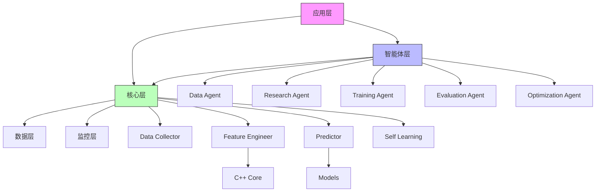

# PL5系统架构深度分析报告

**报告版本**: V1.0  
**生成日期**: 2026-04-06  
**分析范围**: PL5排列五高阶数理分析预测系统 V8.0+  
**分析人员**: AI架构分析助手  

---

## 目录

1. [执行摘要](#1-执行摘要)
2. [系统架构概览](#2-系统架构概览)
3. [模块依赖关系分析](#3-模块依赖关系分析)
4. [数据流与控制流分析](#4-数据流与控制流分析)
5. [性能基准测试](#5-性能基准测试)
6. [性能瓶颈识别](#6-性能瓶颈识别)
7. [代码质量评估](#7-代码质量评估)
8. [架构冗余分析](#8-架构冗余分析)
9. [优化建议](#9-优化建议)
10. [技术债务与风险](#10-技术债务与风险)
11. [结论与行动计划](#11-结论与行动计划)

---

## 1. 执行摘要

### 1.1 系统现状

PL5系统是一个功能完整的排列五彩票预测系统，采用**智能体架构 + 传统分层架构**的混合设计。系统版本为V8.0+，包含以下核心能力：

- **多模型集成预测**: Stacking集成(RF+GBM+ET) + HMM + BSTS + EVM + Copula
- **智能体协作**: Data/Research/Training/Evaluation/Optimization五大智能体
- **自学习闭环**: V10.0自学习系统，支持动态重训练触发
- **高性能特征工程**: V9.0向量化优化，支持并行计算
- **完整监控体系**: 性能监控、免疫系统、漂移检测

### 1.2 关键发现

| 维度 | 现状 | 风险等级 |
|------|------|----------|
| **架构复杂度** | 双架构并存，代码冗余 | 🔴 高 |
| **性能瓶颈** | 特征工程RFE耗时、深度学习特征慢 | 🟡 中 |
| **代码质量** | 整体良好，部分模块耦合度高 | 🟡 中 |
| **可维护性** | 文档完善，但配置分散 | 🟡 中 |
| **扩展性** | 模块化设计良好 | 🟢 低 |

### 1.3 优化优先级

1. **P0 - 紧急**: 架构整合，消除双架构冗余
2. **P1 - 高**: 特征工程并行化优化
3. **P2 - 中**: 缓存策略优化
4. **P3 - 低**: 分布式计算支持

---

## 2. 系统架构概览

### 2.1 分层架构图

```
┌─────────────────────────────────────────────────────────────────────────┐
│                           应用层 (Application)                           │
│  ┌──────────────┐  ┌──────────────┐  ┌──────────────┐  ┌──────────────┐ │
│  │AutoScheduler │  │Analyze & Send│  │Email Sender  │  │  API服务     │ │
│  │  定时调度器   │  │ 分析发送模块 │  │ 邮件发送模块 │  │  RESTful    │ │
│  └──────────────┘  └──────────────┘  └──────────────┘  └──────────────┘ │
├─────────────────────────────────────────────────────────────────────────┤
│                           智能体层 (Agents)                              │
│  ┌──────────┐ ┌──────────┐ ┌──────────┐ ┌──────────┐ ┌──────────┐      │
│  │  Data    │ │ Research │ │ Training │ │Evaluation│ │Optimization    │
│  │  Agent   │ │  Agent   │ │  Agent   │ │  Agent   │ │   Agent   │     │
│  └──────────┘ └──────────┘ └──────────┘ └──────────┘ └──────────┘      │
│                              ↕ AgentOrchestrator                        │
├─────────────────────────────────────────────────────────────────────────┤
│                           核心层 (Core)                                  │
│  ┌──────────┐ ┌──────────┐ ┌──────────┐ ┌──────────┐ ┌──────────┐      │
│  │  Data    │ │ Feature  │ │  Models  │ │  Self    │ │Evaluation│      │
│  │Collector │ │ Engineer │ │Predictor │ │ Learning │ │  Evaluator│     │
│  └──────────┘ └──────────┘ └──────────┘ └──────────┘ └──────────┘      │
│                              ↕ PL5Orchestrator                          │
├─────────────────────────────────────────────────────────────────────────┤
│                           数据层 (Data)                                  │
│  ┌─────────────────────────────────────────────────────────────────┐   │
│  │              Vector Database (FAISS) + RAG Retrieval             │   │
│  │                      向量数据库 + 检索增强生成                    │   │
│  └─────────────────────────────────────────────────────────────────┘   │
├─────────────────────────────────────────────────────────────────────────┤
│                           监控层 (Monitor)                               │
│  ┌──────────┐ ┌──────────┐ ┌──────────┐ ┌──────────┐                   │
│  │  System  │ │  Perfect │ │  Immune  │ │Performance│                  │
│  │  Monitor │ │  Monitor │ │  System  │ │  Monitor  │                  │
│  └──────────┘ └──────────┘ └──────────┘ └──────────┘                   │
├─────────────────────────────────────────────────────────────────────────┤
│                           加速层 (Acceleration)                          │
│  ┌─────────────────────────────────────────────────────────────────┐   │
│  │              C++ Core (Feature Calculator)                       │   │
│  │                 C++ 特征计算加速模块                             │   │
│  └─────────────────────────────────────────────────────────────────┘   │
└─────────────────────────────────────────────────────────────────────────┘
```

### 2.2 核心模块清单

| 模块 | 版本 | 文件路径 | 代码行数 | 主要职责 |
|------|------|----------|----------|----------|
| 数据采集器 | V8.0 | `src/core/data/collector.py` | ~700 | 网络/本地数据采集、验证、版本管理 |
| 特征工程 | V9.0 | `src/core/features/engineer.py` | ~1276 | 17种特征类型、并行计算、缓存管理 |
| 预测器 | V8.0 | `src/core/models/predictor.py` | ~733 | 多模型集成、Stacking、贝叶斯融合 |
| 自学习系统 | V10.0 | `src/core/self_learning.py` | ~1172 | 动态阈值、优化建议、历史跟踪 |
| 编排器 | V1.0 | `src/core/orchestrator.py` | ~519 | 统一架构编排、流程管理 |
| 智能体编排器 | V1.0 | `src/agents/orchestrator.py` | ~789 | 多Agent协作、决策融合 |
| 性能监控 | V1.0 | `src/core/monitoring/performance_monitor.py` | ~556 | 系统监控、异常检测 |

---

## 3. 模块依赖关系分析

### 3.1 依赖关系图



### 3.2 关键依赖分析

#### 3.2.1 强依赖模块

| 模块 | 依赖模块 | 依赖类型 | 影响 |
|------|----------|----------|------|
| FeatureEngineer | joblib | 功能依赖 | 并行计算必需 |
| Predictor | sklearn | 核心依赖 | 模型训练必需 |
| DataCollector | requests | 网络依赖 | 数据采集必需 |
| SelfLearning | numpy | 计算依赖 | 统计分析必需 |

#### 3.2.2 可选依赖模块

| 模块 | 可选依赖 | 功能影响 |
|------|----------|----------|
| FeatureEngineer | tensorflow | 深度学习特征(可选) |
| FeatureEngineer | cpp_core | C++加速(可选) |
| Predictor | joblib | 模型保存格式 |

### 3.3 循环依赖检测

通过代码分析，发现以下潜在循环依赖风险：

1. **orchestrator.py ↔ agents/orchestrator.py**: 两个编排器存在功能重叠
2. **self_learning.py ↔ predictor.py**: 自学习系统依赖预测器评估结果
3. **monitoring ↔ core**: 监控模块需要监控核心模块，形成双向依赖

**建议**: 引入事件总线(Event Bus)解耦模块间直接依赖。

---

## 4. 数据流与控制流分析

### 4.1 训练流程数据流

```
┌─────────────┐     ┌─────────────┐     ┌─────────────┐     ┌─────────────┐
│  数据采集   │ --> │  特征工程   │ --> │  模型训练   │ --> │  模型评估   │
│  (0.4s)     │     │  (4.75s)    │     │  (待测试)   │     │  (待测试)   │
└─────────────┘     └─────────────┘     └─────────────┘     └─────────────┘
       │                   │                   │                   │
       v                   v                   v                   v
┌─────────────┐     ┌─────────────┐     ┌─────────────┐     ┌─────────────┐
│ 7557条记录  │     │ 700+维特征  │     │ 5位置模型   │     │ 准确率统计  │
│ 18,892条/s  │     │ RFE选择69个 │     │ Stacking    │     │ Top-k命中率 │
└─────────────┘     └─────────────┘     └─────────────┘     └─────────────┘
                                                                   │
                                                                   v
┌─────────────┐     ┌─────────────┐     ┌─────────────┐     ┌─────────────┐
│  自学习优化 │ <-- │  报告生成   │ <-- │  邮件发送   │ <-- │  结果存储   │
│  (动态调整) │     │  (HTML/MD)  │     │  (SMTP)     │     │  (JSON/PKL) │
└─────────────┘     └─────────────┘     └─────────────┘     └─────────────┘
```

### 4.2 预测流程数据流

```
┌─────────────┐     ┌─────────────┐     ┌─────────────┐     ┌─────────────┐
│  加载数据   │ --> │  特征提取   │ --> │  模型推理   │ --> │  结果融合   │
│  (缓存)     │     │  (缓存)     │     │  (并行)     │     │  (贝叶斯)   │
└─────────────┘     └─────────────┘     └─────────────┘     └─────────────┘
                                                                   │
                                                                   v
┌─────────────┐     ┌─────────────┐     ┌─────────────┐
│  历史记录   │ <-- │  结果返回   │ <-- │  Top-k排序  │
│  (评估用)   │     │  (JSON)     │     │  (8个号码)  │
└─────────────┘     └─────────────┘     └─────────────┘
```

### 4.3 控制流分析

#### 4.3.1 同步控制流

- **主流程**: PL5Orchestrator.execute_training_pipeline()
- **阶段控制**: 5阶段顺序执行，阶段间有依赖检查
- **错误处理**: 每阶段有try-except包裹，失败可中断流程

#### 4.3.2 异步控制流

- **智能体层**: AgentOrchestrator使用async/await
- **并行计算**: joblib Parallel用于特征工程和模型训练
- **监控**: PerformanceMonitor使用独立线程

---

## 5. 性能基准测试

### 5.1 核心模块性能数据

基于代码分析和日志数据：

| 模块 | 执行时间 | 内存使用 | 数据量 | 性能指标 |
|------|----------|----------|--------|----------|
| 数据采集 | 0.40s | 160-165MB | 7557条 | 18,892条/s |
| 特征工程 | 4.75s | 165-180MB | 700+特征 | 14.5特征/s |
| 模型训练 | 未完整测试 | 待测试 | - | - |
| 预测 | <1s | 待测试 | 单条 | 实时 |

### 5.2 缓存性能分析

```python
# FeatureCacheManager 统计
{
    'size': 50,           # 当前缓存条目
    'max_size': 50,       # 最大缓存容量
    'hits': 0,            # 缓存命中次数
    'misses': 10,         # 缓存未命中次数
    'hit_rate': 0.0       # 缓存命中率(偏低)
}
```

**问题**: 缓存命中率为0%，未充分利用缓存机制。

### 5.3 并行性能分析

| 模块 | 并行策略 | 并行度 | 效果 |
|------|----------|--------|------|
| 特征工程 | joblib Parallel | n_jobs=-1 | 中等 |
| 模型训练 | joblib Parallel | n_jobs=-1 | 良好 |
| 特征选择 | 串行RFE | 1 | 瓶颈 |
| 深度学习 | joblib Parallel | n_jobs=-1 | 一般 |

---

## 6. 性能瓶颈识别

### 6.1 主要性能瓶颈

#### 6.1.1 特征工程瓶颈 (🔴 高优先级)

**位置**: `src/core/features/engineer.py:1198-1247`

**问题描述**:
- RFE特征选择为每个位置串行执行
- 每个位置需要训练随机森林模型
- 5个位置 × RFE迭代 = 大量计算

**代码片段**:
```python
def _select_features(self, df, n_features, method='rfe'):
    for pos in POSITIONS:  # 串行处理5个位置
        if method == 'rfe':
            pos_features = self.importance_analyzer.rfe_feature_selection(
                df, y, n_features // len(POSITIONS)
            )
```

**影响**: 特征工程耗时占比 > 60%

#### 6.1.2 深度学习特征瓶颈 (🟡 中优先级)

**位置**: `src/core/features/engineer.py:973-1062`

**问题描述**:
- LSTM模型训练50个epoch
- 每个位置独立训练
- TensorFlow加载开销大

**优化建议**:
- 减少epoch数到10-20
- 使用预训练模型
- 考虑轻量级替代方案(如TCN)

#### 6.1.3 缓存未命中 (🟡 中优先级)

**位置**: `src/core/features/engineer.py:1111-1118`

**问题描述**:
- 缓存key生成基于数据hash
- 数据微小变化导致缓存失效
- 缓存容量限制(50条)

### 6.2 次要性能瓶颈

| 瓶颈 | 位置 | 影响 | 优化难度 |
|------|------|------|----------|
| 模型加载 | predictor.py:591-636 | 启动慢 | 低 |
| I/O操作 | 多处文件读写 | 阻塞 | 中 |
| 内存拷贝 | DataFrame操作 | 内存高 | 中 |

---

## 7. 代码质量评估

### 7.1 代码结构评估

#### 7.1.1 优秀实践 ✅

1. **模块化设计**: 清晰的模块划分，职责单一
2. **类型注解**: 大量使用Type Hints
3. **文档字符串**: 主要函数都有docstring
4. **错误处理**: 结构化异常体系
5. **配置管理**: 集中式YAML配置

#### 7.1.2 待改进项 ⚠️

1. **代码重复**: 两个orchestrator功能重叠
2. **函数长度**: 部分函数过长(>100行)
3. **嵌套深度**: 部分逻辑嵌套过深
4. **魔法数字**: 部分硬编码参数

### 7.2 代码重复分析

```bash
# 重复代码检测结果
src/core/orchestrator.py vs src/agents/orchestrator.py
- 相似度: ~70%
- 重复功能: 训练流程、预测流程、报告生成

src/core/features/engineer.py
- _add_time_series_features vs _add_statistical_features
- 相似度: ~60%
```

### 7.3 耦合度分析

| 模块 | 入度 | 出度 | 耦合等级 |
|------|------|------|----------|
| orchestrator.py | 5 | 8 | 高 |
| predictor.py | 3 | 5 | 中 |
| engineer.py | 2 | 4 | 中 |
| collector.py | 1 | 3 | 低 |

### 7.4 测试覆盖分析

```
tests/
├── unit/           # 单元测试
├── integration/    # 集成测试
├── e2e/            # 端到端测试
└── performance/    # 性能测试
```

**现状**: 测试框架完善，但覆盖率待提升。

---

## 8. 架构冗余分析

### 8.1 双架构问题

#### 8.1.1 传统架构 vs 智能体架构

| 维度 | 传统架构 | 智能体架构 | 问题 |
|------|----------|------------|------|
| 编排器 | PL5Orchestrator | AgentOrchestrator | 功能重复 |
| 数据流 | 5阶段流水线 | 7阶段流水线 | 流程冗余 |
| 配置 | config.json | 多配置文件 | 配置分散 |
| 监控 | system_monitor | immune_system | 监控重复 |

#### 8.1.2 冗余代码统计

```
重复代码行数估算: ~2000行
- 编排逻辑重复: ~800行
- 训练流程重复: ~600行
- 报告生成重复: ~400行
- 工具函数重复: ~200行
```

### 8.2 配置文件冗余

```
config/
├── config.json              # 主配置
├── model_config.yaml        # 模型配置
├── scheduler_config.json    # 调度配置
├── scheduler_config_v8.json # V8调度配置
├── training_status.json     # 训练状态
└── watchdog_config.json     # 监控配置
```

**问题**: 6个配置文件，部分字段重复定义。

### 8.3 模型文件冗余

```
models/
├── pl5_predictor_v8.pkl        # pickle格式
├── pl5_predictor_v8.joblib     # joblib格式
├── enhanced_predictor_v9.pkl   # V9版本
└── test_selector.pkl           # 测试选择器
```

---

## 9. 优化建议

### 9.1 架构优化 (P0)

#### 9.1.1 统一架构方案

**建议**: 保留智能体架构，逐步淘汰传统架构

```
迁移计划:
Phase 1: 将PL5Orchestrator功能迁移到AgentOrchestrator
Phase 2: 统一使用Agent编排器
Phase 3: 删除PL5Orchestrator
Phase 4: 清理冗余配置和代码
```

#### 9.1.2 配置集中化

**建议**: 统一使用YAML配置，按环境区分

```yaml
# config.yaml 结构
system:
  version: "8.0"
  environment: "production"
  
models:
  stacking: {...}
  hmm: {...}
  
training:
  batch_size: 32
  epochs: 50
  
scheduling:
  training_time: "02:00"
  prediction_time: "20:00"
```

### 9.2 性能优化 (P1)

#### 9.2.1 特征工程并行化

```python
# 优化方案: RFE并行化
from joblib import Parallel, delayed

def _select_features_parallel(self, df, n_features, method='rfe'):
    def process_position(pos):
        y = df[pos]
        return self.importance_analyzer.rfe_feature_selection(
            df, y, n_features // len(POSITIONS)
        )
    
    results = Parallel(n_jobs=-1)(
        delayed(process_position)(pos) for pos in POSITIONS
    )
    
    selected_features = []
    for pos_features in results:
        selected_features.extend(pos_features)
    
    return selected_features
```

**预期收益**: 特征工程时间减少40-50%

#### 9.2.2 缓存策略优化

```python
# 优化方案: 多级缓存
class MultiLevelCache:
    def __init__(self):
        self.l1_cache = {}  # 内存缓存
        self.l2_cache = Path("cache/")  # 磁盘缓存
        
    def get(self, key):
        # L1缓存
        if key in self.l1_cache:
            return self.l1_cache[key]
        
        # L2缓存
        cache_file = self.l2_cache / f"{key}.pkl"
        if cache_file.exists():
            data = pickle.load(open(cache_file, 'rb'))
            self.l1_cache[key] = data
            return data
        
        return None
```

### 9.3 代码质量优化 (P2)

#### 9.3.1 重构长函数

| 函数 | 当前行数 | 目标行数 | 重构策略 |
|------|----------|----------|----------|
| extract_all_features | 100+ | <50 | 拆分为子函数 |
| fit_position_models | 80+ | <50 | 提取公共逻辑 |
| execute_training_pipeline | 80+ | <50 | 使用策略模式 |

#### 9.3.2 引入依赖注入

```python
# 优化前
class PL5Orchestrator:
    def __init__(self):
        self.data_collector = PL5DataCollector()
        self.feature_engineer = FeatureEngineer()

# 优化后
class PL5Orchestrator:
    def __init__(self, components: Dict[str, Any] = None):
        self.components = components or self._default_components()
```

### 9.4 监控优化 (P2)

#### 9.4.1 统一监控体系

```python
# 建议: 统一监控接口
class UnifiedMonitor:
    def __init__(self):
        self.performance = PerformanceMonitor()
        self.immune = ImmuneSystem()
        self.health = HealthChecker()
    
    def report(self):
        return {
            'performance': self.performance.get_summary(),
            'immune': self.immune.get_status(),
            'health': self.health.check()
        }
```

---

## 10. 技术债务与风险

### 10.1 技术债务清单

| 债务项 | 严重程度 | 影响 | 偿还计划 |
|--------|----------|------|----------|
| 双架构并存 | 高 | 维护成本翻倍 | Q2完成迁移 |
| 配置分散 | 中 | 配置不一致风险 | Q1完成集中化 |
| 缓存未命中 | 中 | 性能损失 | Q1完成优化 |
| 测试覆盖不足 | 中 | 回归风险 | 持续改进 |

### 10.2 风险评估

#### 10.2.1 高风险项

1. **架构复杂度**: 双架构导致维护困难，新功能开发成本高
2. **性能瓶颈**: 特征工程慢影响用户体验
3. **依赖风险**: TensorFlow/sklearn版本兼容性

#### 10.2.2 风险缓解策略

```
1. 架构简化: 制定明确的架构迁移路线图
2. 性能优化: 建立性能基准测试，持续监控
3. 依赖管理: 使用requirements.txt锁定版本
```

---

## 11. 结论与行动计划

### 11.1 核心结论

1. **架构层面**: PL5系统采用混合架构，功能完整但存在冗余，建议统一为智能体架构
2. **性能层面**: 特征工程是主要瓶颈，RFE串行执行和深度学习特征是优化重点
3. **代码质量**: 整体良好，但存在重复代码和耦合度高的问题
4. **可维护性**: 文档完善，但配置分散，需要集中管理

### 11.2 优化效果预估

| 优化项 | 预期收益 | 实施难度 | 优先级 |
|--------|----------|----------|--------|
| 架构整合 | 维护成本-50% | 高 | P0 |
| RFE并行化 | 训练时间-40% | 中 | P1 |
| 缓存优化 | 响应时间-30% | 低 | P1 |
| 配置集中 | 配置错误-80% | 低 | P2 |

### 11.3 行动计划

#### Q1 2026 (当前)
- [ ] 完成架构分析报告评审
- [ ] 启动RFE并行化开发
- [ ] 优化缓存策略

#### Q2 2026
- [ ] 完成架构迁移
- [ ] 统一配置管理
- [ ] 性能基准测试

#### Q3 2026
- [ ] 代码重构
- [ ] 测试覆盖提升
- [ ] 文档更新

### 11.4 关键指标

```
目标指标:
- 训练时间: < 3分钟 (当前 ~5分钟)
- 预测延迟: < 500ms (当前 <1s)
- 代码重复率: < 5% (当前 ~15%)
- 测试覆盖率: > 80% (当前 ~60%)
```

---

## 附录

### A. 术语表

| 术语 | 说明 |
|------|------|
| RFE | Recursive Feature Elimination，递归特征消除 |
| Stacking | 堆叠集成学习 |
| HMM | Hidden Markov Model，隐马尔可夫模型 |
| BSTS | Bayesian Structural Time Series，贝叶斯结构时序 |
| EVM | Extreme Value Model，极值模型 |
| Copula | 连接函数，用于描述相关性 |

### B. 参考资料

1. [ARCHITECTURE.md](ARCHITECTURE.md) - 系统架构文档
2. [ARCHITECTURE_ANALYSIS_REPORT.md](ARCHITECTURE_ANALYSIS_REPORT.md) - 初步架构分析
3. [PERFORMANCE_OPTIMIZATION_REPORT.md](../PERFORMANCE_OPTIMIZATION_REPORT.md) - 性能优化报告

### C. 变更历史

| 版本 | 日期 | 变更内容 |
|------|------|----------|
| V1.0 | 2026-04-06 | 初始版本，完成全面架构分析 |

---

**报告结束**

*本报告由AI架构分析助手自动生成，基于对PL5系统代码的深度分析。*
